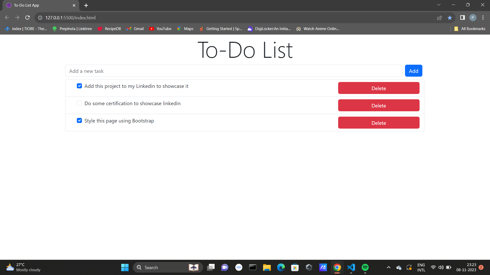

# To-Do List Web App

This web application provides a convenient way to manage your tasks. You can easily add, complete, and delete tasks to stay organized and productive.

## Output


## Features

- Add tasks: Enter a task description and click "Add" to create a new task.
- Complete tasks: Check the checkbox next to a task to mark it as complete.
- Delete tasks: Click the "Delete" button to remove a task from your list.
- Responsive Design: The application is responsive and works well on various devices.

## Getting Started

Follow these instructions to get a copy of the project up and running on your local machine.

### Prerequisites

You need a web browser to run this application.

### Installation

1. Clone the repository to your local machine:

```bash
git clone https://github.com/Prabakaran-MS/To-Do-list-Web-App.git
